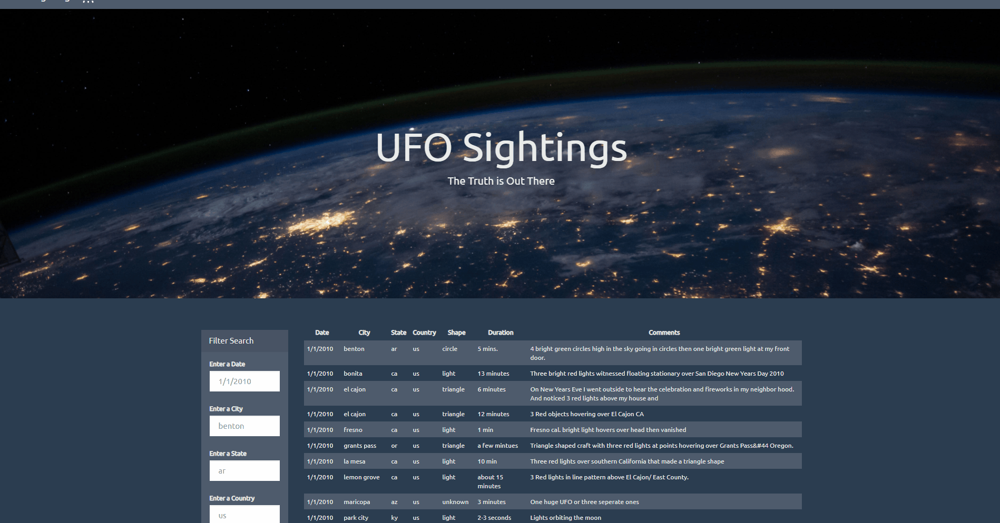

# javascript-challenge

## Background

The purpose of this project is to create an interactive web-page where the user can filter the data by filling out the filter search box.  The filtering part was done by using javascript with combination of DOM manipulation and the entire project was completed by using JavaScript, HTML, and CSS, and D3.js. The dataset contains information of UFO sightings and it is broken down by date, city, state, country, shape and comment. The following data that was used is named data.js and can be located in
[here](https://github.com/jamess2eagle/javascript-challenge/tree/master/UFO-level-2/static/js/data.js)

There are two versions (UFO-level-1 and UFO-level-2) of this web-page and the only difference is that level-1 only provides one field to filter the data by date whereas level-2 has five different fields to filter the data.
Each folder consists of a static folder that consists of css, images and js files. The javascript file that contains filter functionality is named app.js and the following file can be located [here](https://github.com/jamess2eagle/javascript-challenge/tree/master/UFO-level-2/static/js/app.js)

## Preview of UFO-level-2

